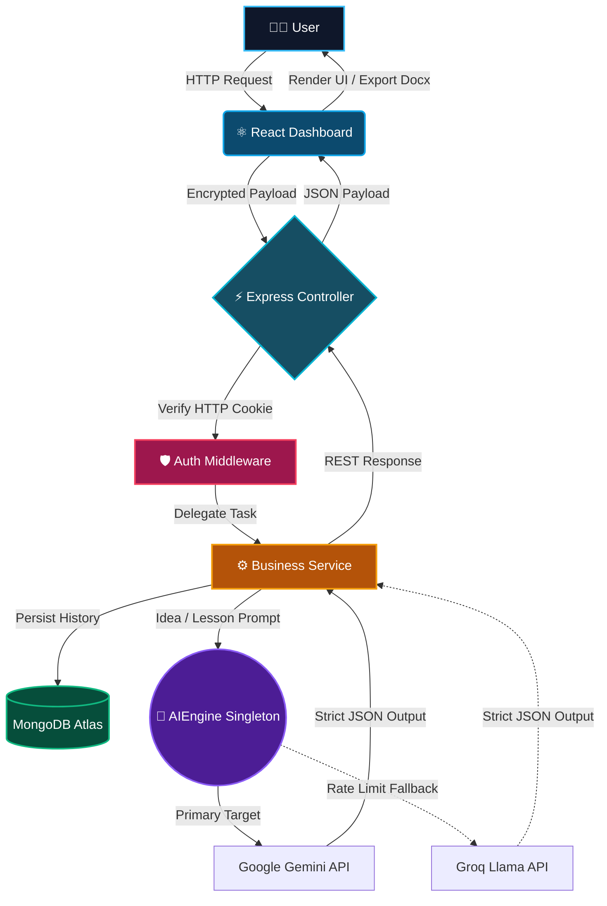
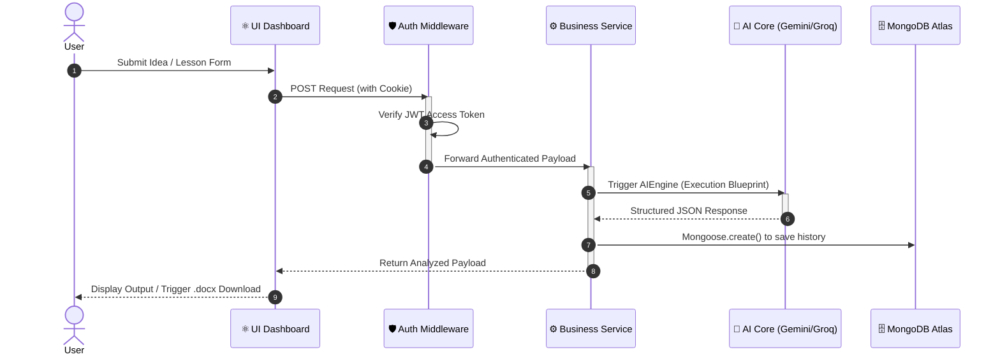

<div align="center">
  


<h3 align="center">🚀 THE NEXT-GEN AI PRODUCT ARCHITECT</h3>

<p align="center">
<b>BayaX</b> is an ultra-advanced AI engine that converts chaotic startup ideas into mathematically structured, foolproof execution blueprints. No more guessing. Just pure execution.
</p>

<p align="center">
  <a href="#"></a>
  <a href="#"></a>
  <a href="#"></a>
  <a href="#"></a>
  <a href="#"></a>
  <a href="#"></a>
</p>

<p align="center">
  <span style="font-size: 40px;">🚀</span>
  <span style="font-size: 40px;">🧠</span>
  <span style="font-size: 40px;">🌌</span>
</p>

</div>

---

## 🌌 The Vision

Most startups fail because of a lack of *clarity* and *structure*. **BayaX** bridges the gap between an abstract thought and a billion-dollar execution plan. Just feed it a niche or a raw idea, and watch the AI construct your entire path.


---

## ⚡ Core Arsenal (Features)

<details open>
  <summary><b>🧠 Startup Blueprint Generator</b></summary>
  <blockquote>Harnesses Generative LLMs to validate, refine, and structure your abstract ideas into a highly coherent product thesis, complete with Tech Stack recommendations and Market Feasibility parameters.</blockquote>
</details>

<details open>
  <summary><b>📚 Automated Lesson Plan Architect</b></summary>
  <blockquote>Dynamically generates comprehensive K-12 educational lesson plans complete with factual/conceptual objectives, expected queries, and automated <code>.docx</code> document exports directly downloaded to the browser.</blockquote>
</details>

<details open>
  <summary><b>🛡️ Secure JWT Authentication</b></summary>
  <blockquote>Enterprise-grade security using HttpOnly cookies, Bcrypt password hashing, and Access/Refresh token rotation flows to securely protect user portfolios and lesson histories.</blockquote>
</details>

<details open>
  <summary><b>⚡ Multi-LLM Fallback Engine</b></summary>
  <blockquote>Guaranteed uptime through a robust Strategy Pattern. If Google's Gemini SDK faces downtime or rate limits, the engine instantaneously pivots to Groq's blazing-fast Llama 3 model silently in the background.</blockquote>
</details>

---

## 🧬 Architectural DNA (System Design)

BayaX operates on a highly optimized **3-Tier MVC Architecture** integrated with bleeding-edge AI API gateways.

<div align="center">



</div>

---

## 🏗️ Design Patterns & SOLID Principles

BayaX is built on a highly robust, enterprise-grade architecture. To ensure scalability, testability, and maintainability, the following design patterns and SOLID principles are deeply integrated into the codebase:

### 🧩 Core Design Patterns

1. **Singleton Pattern** (`AIEngine.ts`, `DatabaseConnection.ts`)  
   **How & Why:** Guarantees that only one instance of the AI SDK or MongoDB connection exists in memory. This prevents the server from crashing or getting rate-limited if 100 users attempt to generate ideas simultaneously by forcing them to queue through a highly optimized global engine.

2. **MVC-S Pattern (Model-View-Controller-Service)**  
   **How & Why:** The backbone of BayaX's separation of concerns. Controllers exclusively handle HTTP requests, Services manage all heavy business logic and API orchestration, and Models bind strictly to the database. This prevents spaghetti code and makes components fiercely scalable.

3. **Fallback Strategy Pattern** (`AIEngine.ts`)  
   **How & Why:** AI networks can have downtime. BayaX implements a dynamic fallback strategy. The primary strategy attempts `callGemini()`. If it hits a rate limit or failure, the system automatically catches the exception and pivots to a backup strategy: `callGroq()`. The user experiences zero downtime.

4. **Chain of Responsibility (Middleware Pattern)** (`auth.ts`)  
   **How & Why:** Instead of repeating token validation logic across 50 controllers, the `AuthMiddleware` intercepts incoming requests, decodes the JWT, and verifies the user. If valid, it passes control forward via `next()`; if compromised, it terminates the chain with a `403 Forbidden`.

5. **Facade Pattern** (`JWTService.ts`, `ConvertUtils.ts`)  
   **How & Why:** Masks complex third-party library internals. Generating mathematical `.docx` table structures is complex, but the controllers never see it—they just call `createDocument()`. Swapping dependencies in the future requires zero changes to the core application.

### 🏛️ SOLID Principles Implemented

*   **S (Single Responsibility Principle):** Controllers manage HTTP, Services manage execution logic, and Utilities manage distinct tasks (like Tokens). No file attempts to do two unrelated jobs.
*   **O (Open/Closed Principle):** The `AIEngine.execute()` method is firmly closed for modification to the outside services, but internally open for extension (e.g., adding an OpenAI handler method does not require changing the Idea Service).
*   **I (Interface Segregation Principle):** BayaX strictly relies on segregated, tiny functional interfaces like `LessonInput` or `AuthTokens` instead of forcing a massive `IUserPayload` onto services that don't need all the data properties.
*   **D (Dependency Inversion Principle):** Controllers interact with high-level service abstractions (e.g., `ideaService.storeProject()`) rather than writing low-level Mongoose query instructions. You could swap MongoDB for PostgreSQL without breaking the presentation layer.

---

## 🎮 Execution Flow (Sequence)

How exactly does BayaX read your mind? Here is the data flow vector:

<div align="center">



</div>

---

## ⚙️ Hyper-Drive Boot Sequence (Setup)

Ready to run BayaX on your local mainframe?

### 1. Clone the Matrix
```bash
git clone https://github.com/samay-hash/bayax.git
cd bayax
```

### 2. Ignite the Backend Core
```bash
cd src/backend
# Setup your environment variables via .env.example
cp .env.example .env
npm install
npm run build
npm start
```

### 3. Spin up the Visualizer (Frontend)
```bash
cd ../frontend
# Setup your environment variables
cp .env.example .env
npm install
npm run dev
```

> **Target Acquired:** Open [http://localhost:5173](http://localhost:5173) in your browser to experience the future.

---

<div align="center">
  
  
  <b>Designed for Visionaries. Built by the BayaX Team.</b><br/>
  <i>Leave a ⭐ if BayaX blew your mind!</i>
</div>
