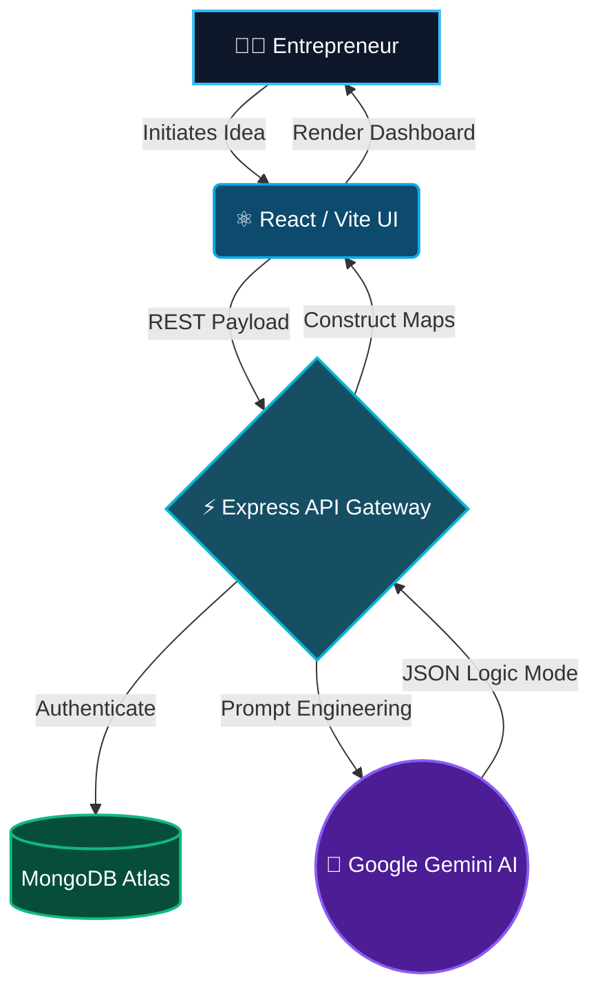
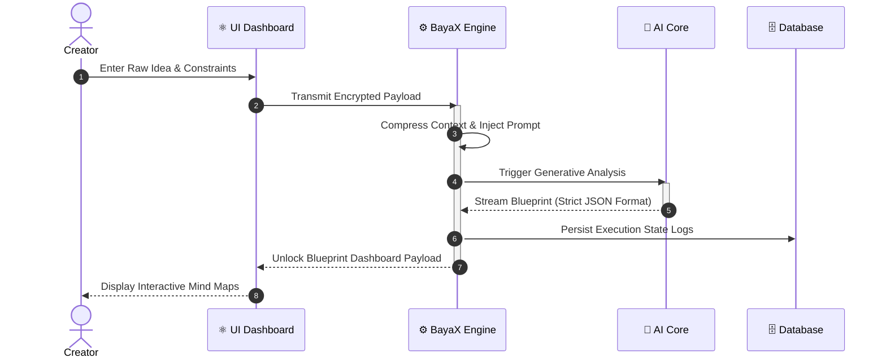

<div align="center">
  


<h3 align="center">🚀 THE NEXT-GEN AI PRODUCT ARCHITECT</h3>

<p align="center">
<b>BayaX</b> is an ultra-advanced AI engine that converts chaotic startup ideas into mathematically structured, foolproof execution blueprints. No more guessing. Just pure execution.
</p>

<p align="center">
  <a href="#"></a>
  <a href="#"></a>
  <a href="#"></a>
  <a href="#"></a>
</p>

<p align="center">
  <span style="font-size: 40px;">🚀</span>
  <span style="font-size: 40px;">🧠</span>
  <span style="font-size: 40px;">🌌</span>
</p>

</div>

---

## 🌌 The Vision

Most startups fail because of a lack of *clarity* and *structure*. **BayaX** bridges the gap between an abstract thought and a billion-dollar execution plan. Just feed it a niche or a raw idea, and watch the AI construct your entire path.


---

## ⚡ Core Arsenal (Features)

<details open>
  <summary><b>🧠 Cognitive Refinement</b></summary>
  <blockquote>Harnesses Generative LLMs to validate, refine, and structure your abstract ideas into a highly coherent product thesis.</blockquote>
</details>

<details open>
  <summary><b>♟️ Market Feasibility Engine</b></summary>
  <blockquote>Generates real-time monetization strategies, audience mapping, and calculates an absolute "Market Proof Score".</blockquote>
</details>

<details open>
  <summary><b>🕸️ Neural Mind-Mapping</b></summary>
  <blockquote>Renders a dynamic, visual interactive tree of your architectural workflow. You see exactly how the product is partitioned.</blockquote>
</details>

<details open>
  <summary><b>⏱️ Phase-by-Phase Roadmap</b></summary>
  <blockquote>Breaks down the abstract timeline into strict MVP, Beta, and Scalability phases with exact technical specifications.</blockquote>
</details>

---

## 🧬 Architectural DNA (System Design)

BayaX operates on a highly optimized **3-Tier MVC Architecture** integrated with bleeding-edge AI API gateways.

<div align="center">



</div>

---

## 🎮 Execution Flow (Sequence)

How exactly does BayaX read your mind? Here is the data flow vector:

<div align="center">



</div>

---

## ⚙️ Hyper-Drive Boot Sequence (Setup)

Ready to run BayaX on your local mainframe?

### 1. Clone the Matrix
```bash
git clone https://github.com/samay-hash/bayax.git
cd bayax
```

### 2. Ignite the Backend Core
```bash
cd src/backend
# Setup your environment variables via .env.example
cp .env.example .env
npm install
npm run build
npm start
```

### 3. Spin up the Visualizer (Frontend)
```bash
cd ../frontend
# Setup your environment variables
cp .env.example .env
npm install
npm run dev
```

> **Target Acquired:** Open [http://localhost:5173](http://localhost:5173) in your browser to experience the future.

---

<div align="center">
  
  
  <b>Designed for Visionaries. Built by Samay Samrat.</b><br/>
  <i>Leave a ⭐ if BayaX blew your mind!</i>
</div>
