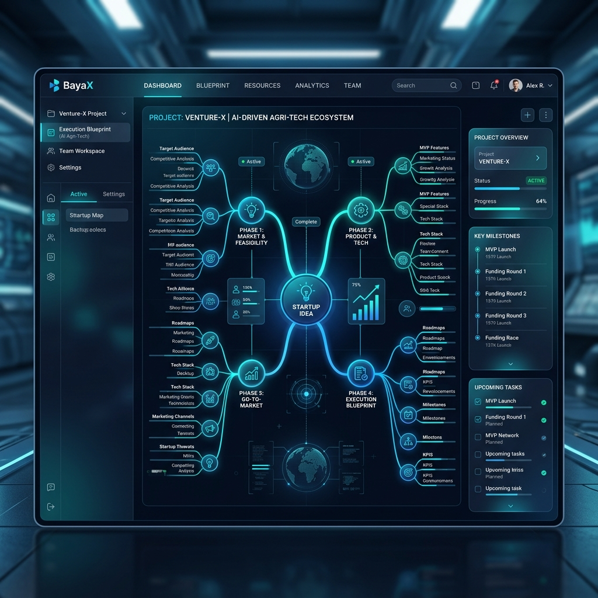
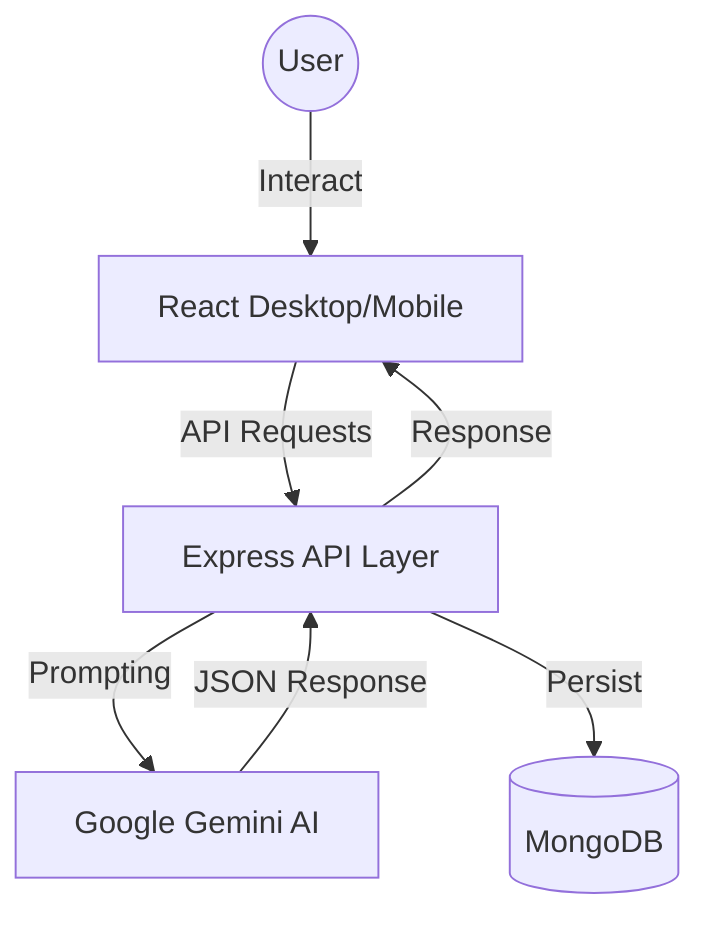

<div align="center">

# 🚀 BayaX 
### *AI-Powered Product Architect & Execution Flow Generator*

[](https://opensource.org/licenses/MIT)
[](https://nodejs.org/)
[](https://reactjs.org/)
[](https://vitejs.dev/)
[](https://tailwindcss.com/)

---



**BayaX** is a cutting-edge AI Product Architect platform designed to transform abstract startup ideas into comprehensive, actionable execution blueprints. Whether you have a vague field of interest or a specific vision, BayaX utilizes Generative AI to map out your path to success.

[Explore Features](#-key-features) • [Installation](#-getting-started) • [Architecture](#-system-architecture) • [Use Cases](#-use-cases)

</div>

---

## ✨ Key Features

- **🎯 Intelligent Concept Refinement**: Converts vague inputs into structured, viable product concepts.
- **📊 Market Proof Analysis**: Real-time market data analysis, competitor mapping, and monetization scoring.
- **🧠 Visual Mind Mapping**: Dynamic tree-based visualization of your product's structural hierarchy.
- **🚀 Execution Roadmap**: Phase-by-phase MVP development steps and critical growth milestones.
- **💻 Tech Stack Recommendation**: AI-curated technology recommendations tailored to your project's specific needs.
- **📄 Professional Export**: Download your entire blueprint as a PDF or export directly to Notion.

---

## 🛠 Tech Stack

| Layer | Technologies |
| :--- | :--- |
| **Frontend** | React 18, Vite, Tailwind CSS, Framer Motion, Recoil |
| **Backend** | Node.js, Express, TypeScript, Zod |
| **Database** | MongoDB (Mongoose) |
| **AI Engine** | Google Gemini 2.0 Flash / Pro |
| **DevOps** | Vercel (Frontend), Render/Docker (Backend) |

---

## 🏗 System Architecture

BayaX follows a robust **MVC (Model-View-Controller)** pattern with a 3-tier layered architecture for maximum scalability and maintainability.



---

## 📊 Use Case Diagram

The platform serves entrepreneurs, product managers, and developers by automating the "zeroth phase" of product development.

```mermaid
useCaseDiagram
    actor "User" as User
    actor "Gemini AI" as AI
    package "BayaX System" {
        usecase "Ideation & Refinement" as UC1
        usecase "Market Feasibility" as UC2
        usecase "Architectural Mapping" as UC3
        usecase "Download Report" as UC4
    }
    User --> UC1
    User --> UC2
    User --> UC3
    User --> UC4
    UC1 ..> AI : "Generative Analysis"
    UC3 ..> AI : "Logic Flow Design"
```

---

## 🚀 Getting Started

### Prerequisites
- Node.js (v18+)
- MongoDB Atlas account or local installation
- Google Gemini API Key

### Installation

1. **Clone the repository**
   ```bash
   git clone https://github.com/your-username/bayax.git
   cd bayax
   ```

2. **Setup Backend**
   ```bash
   cd src/backend
   cp .env.example .env
   # Edit .env with your MONGO_URI and GEMINI_API_KEY
   npm install
   npm run dev
   ```

3. **Setup Frontend**
   ```bash
   cd ../frontend
   cp .env.example .env
   npm install
   npm run dev
   ```

---

## 📸 Demo Screenshots

| Dashboard | Result Analysis |
| :---: | :---: |
|  |  |
| *Intuitive 3-step wizard* | *Deep-dive execution blueprint* |

---

## 📄 License
This project is licensed under the MIT License - see the [LICENSE](LICENSE) file for details.

---

<div align="center">
Built with ❤️ by <b>Samay Samrat</b> & BayaX Team
</div>
