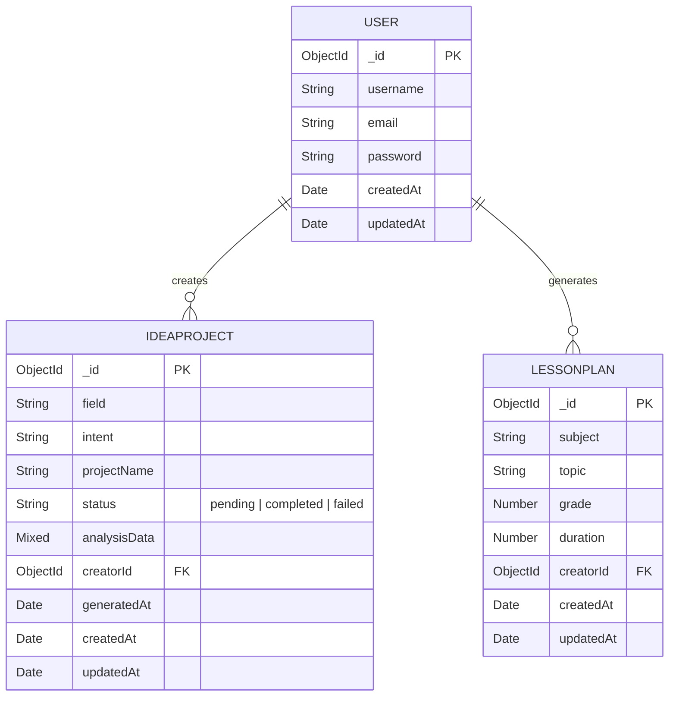
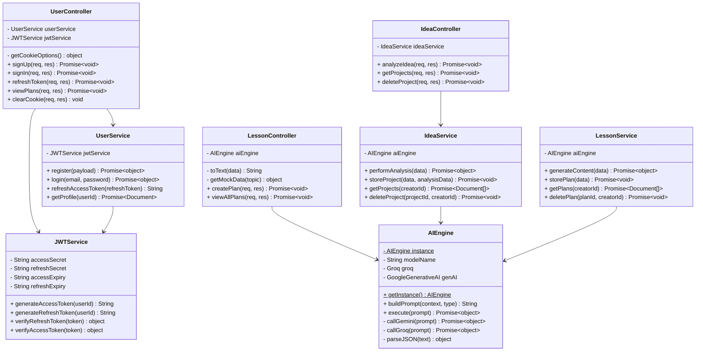
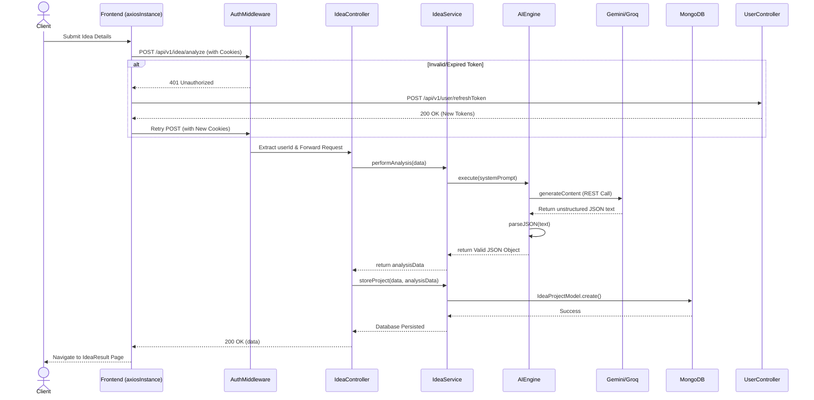

# BayaX System Diagrams

### 1. Entity-Relationship (ER) Diagram
This diagram represents the exact Database schema relationships based on your current Mongoose models.

### 2. System Class Diagram
Displays exactly the MVC Layer, Controllers, and Services available in the TypeScript backend.

### 3. Sequence Diagram (Idea Generation Flow)
Maps out the exact request lifecycle for generating a new AI Blueprint. 

